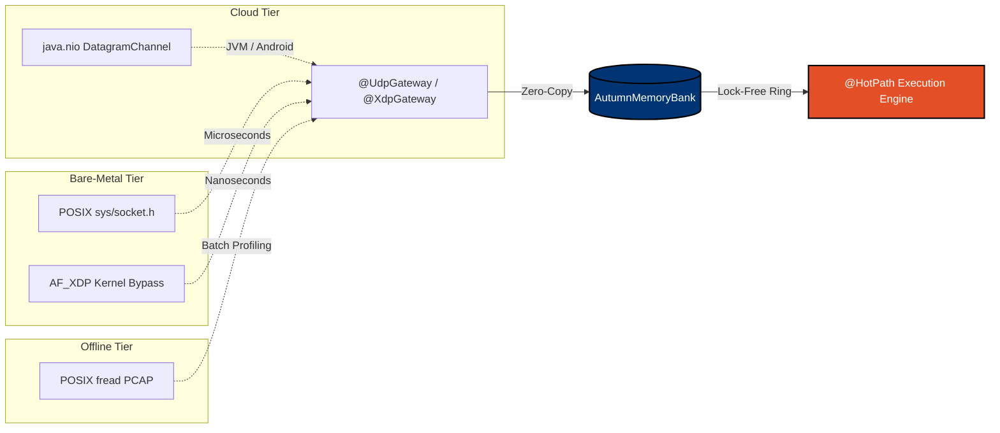
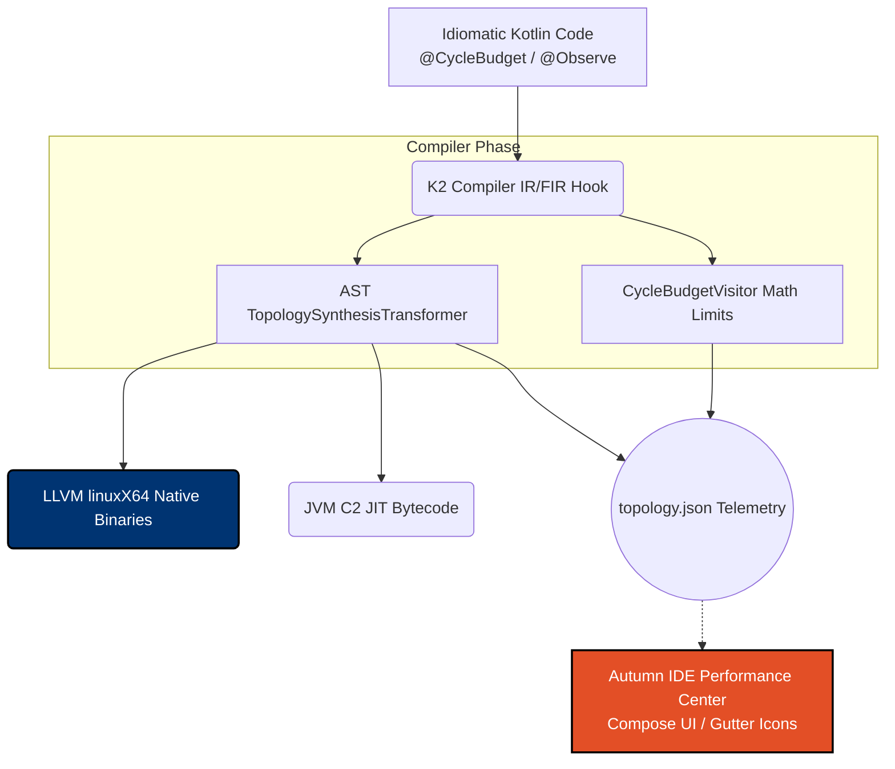

# autumn


**Mathematical Runtime Certification via Structural Static Analysis for Kotlin Multiplatform.**

Autumn aims to be an aerospace-grade, high-frequency execution framework that introduces **Clock-Aware Programming** to commodity CPUs. By treating memory as a pure static topology and enforcing mathematical cycle limits at the compiler level, Autumn's goal is to allow standard CI/CD pipelines to cryptographically certify software execution bounds.

## What's New in v1.1.0

Autumn v1.1.0 massive leaps forward in hardware observability and LLVM execution speeds:
- ⚡ **Sub-40ns Execution via Kotlin/Native:** By bypassing the JVM entirely and unrolling topologies through LLVM (`linuxX64`), Autumn easily achieves a median cross-thread pipeline latency of **~37 nanoseconds**, with a completely flat **<120 ns P99.99**. No Garbage Collection, no OS thread locks, just pure instruction-level parallelism.
- 🛑 **Compile-Time Hardware Constraints (`@CycleBudget`):** IR evaluation natively performed at compile time. If your branching logic or allocations exceed the physical cycle limit of a CPU, *the compiler breaks your build*.
- 🛠 **The Autumn IDE Performance Center:** A native IntelliJ IDEA Plugin using JetBrains Compose. It visually graphs the pipeline topology and adds live UI gutters (`⚡ 37 / 60 Cycles | Port 1 ALU Pressure`) straight to your code as you type, entirely fueled by JSON telemetry emitted by the K2 compiler.

## What is Clock-Aware Programming?

Traditional managed software hides temporal uncertainty behind dynamic thread schedulers, expensive atomic locks, and unpredictable Garbage Collection. Hardware, however, is deterministic because physical timing is a fundamental design rule. 

Autumn attempts to bring this physical rigor to Kotlin by exploring three architectural pillars:

### 1. Unified Static Memory (Zero-Allocation by Design)
Because memory layouts are entirely flattened and allocated statically at boot (`AutumnMemoryBank`), there is no pointer-chasing and no Garbage Collector footprint. Applications map directly to the CPU's L1/L2 cache, opening the door for high-performance zero-copy auditing and deterministic state databases.

### 2. The Universal FSM Boundary (Eliminating Asynchronous I/O)

Every piece of application state lives inside a statically allocated Autumn Memory Bank. There are no blocking connections to read files, sockets, or standard input streams. I/O is resolved via **Kernel Bypass (AF_XDP/eBPF)** for local networks, or POSIX `fread` for offline testing.
By attaching directly to XDP rings via native C-interop, the pipeline translates 4 million real historical `NASDAQ_ITCH50` packets per second deterministically on a single commodity hardware core.
Modern software manages slow communication (Network, Disk, Databases, HTTP) using abstractions like Coroutines, Promises, or Async/Await. These mechanisms introduce massive overhead through context switching and heap-allocated state machines. 

Autumn discards the asynchronous model entirely by abstracting *all* costly communication into a **BoundaryChannel**. The Business Logic is modeled as a pure Finite State Machine (FSM) that never blocks, never sleeps, and never waits. It aims to execute deterministically, computing state transitions instantly. Any interaction with the unpredictable "outside world" is pushed across a zero-copy ring-buffer boundary. Whether the event is an AF_XDP network packet, an `io_uring` SSD read, or an HTTP payload, the application purely reacts to memory-mapped state transitions. Hardware latency is conceptually partitioned away from the logic.

### 3. Deterministic Threading (Lock-Free by Schedule)
Autumn explores eliminating atomic variables and Mutex locks in the hot path. Data entering the system is passed through a lock-free `HashRouter`, which shards the data and statically routes it to a specific `Arbiter` core. Because the execution budget is bounded and thread affinity is isolated, the goal is for synchronization to happen by *timing schedule*, rather than runtime blocking.

## The Autumn Certifier (`autumn-certifier`)

Because the architecture depends on deterministic memory and pinned routines, Autumn aims to physically prove its behavior.

During compilation, the K2 `TopologySynthesisTransformer` extracts the exact Control Flow Graphs (CFG) and loop boundaries (`@MaxIterations`) into a JSON topology. The `autumn-certifier` Gradle plugin then executes this exact trace natively on Linux via `perf stat`, validating that the physical hardware trace does not exceed the mathematical ceilings generated by the compiler.

## The Unified Data Pipeline & Pluggable Network Stack

Because Autumn treats data structures purely as isolated index math on memory, the **Business Logic does not care how the bytes arrive.** We formalized three transport tiers (ADR-0030) ensuring zero-allocation network ingestion across all cloud and bare-metal environments:



- **Cloud & Mobile Tier**: Standard non-blocking `java.nio` sockets map elegantly to managed Kubernetes workloads, Android, and macOS.
- **Bare-Metal Tier**: `linuxX64` architectural builds leverage native LLVM POSIX `recvfrom` and `AF_XDP` hooks to unlock 700k+ to 34M+ ops/sec throughput strictly to the NIC.
- **Offline Tier**: Direct memory-mapped backtesting natively streams terabytes of binary payloads deterministically without OS socket scheduling constraints.

Once bytes organically cross the boundary layer into the `AutumnMemoryBank`, the remaining pipeline operates flawlessly:
- **Config & Registry**: parses the arrays as pure pointer offsets.
- **Epoch State Engine**: tracks slot mutations and emits a single coalesced wake-up pulse, dropping all intermediate state tearing.
- **Display / Logic**: Wakes up exactly once per tick to securely bind to the static boundaries.

## Key features

- **Array-based, pointer-free data structures**: all internal data — configuration tables, resource registries, list items, and form state — is stored in flat pre-allocated arrays accessed by integer index and byte offset. There are no object graphs, no pointer chains, and no GC-visible references between data items.
- **Deterministic Game Engines & ECS (Data-Oriented Design)**: High-performance game engines require strict 16ms/8ms frame budgets to guarantee 60/120fps physics and rendering. Autumn's SoA (Structure of Arrays) layout is natively an Entity Component System (ECS). By wrapping a game's physics or render step in an `@CycleBudget`, the compiler mathematically guarantees a locked frame rate across Android, iOS, and WebAssembly, absolutely impervious to GC stutters.
- **FSM-Based Reactivity**: replaces traditional flow observers with a single lock-free `IntArray` state engine, ensuring the FSM natively coalesces pulses and never chokes on backpressure.
- **K2 Compiler Enforcement**: physically rewrites the syntax tree at compile-time to enforce hardware partition limits and inject memory boundaries via `@InjectBudget`.
- **Clock-Aware UI rendering**: keeps rendering close to each platform while executing a fully shared, static execution pipeline.

n### Kotlin K2 Compiler Integration (A Hardware Description Language for the JVM/Native)
Autumn effectively acts as a hardware description language that compiles natively to the JVM and LLVM. The Autumn compiler plugin intercepts the Kotlin Abstract Syntax Tree (AST) to generate and resolve data layouts that standard Kotlin runtimes cannot mathematically support. By simply placing declarative annotations (`@BoundaryChannel`, `@Pipelined`), developers write what looks like standard Kotlin business logic.


Autumn effectively acts as a hardware description language that compiles natively to the JVM. The Autumn compiler plugin intercepts the Kotlin Abstract Syntax Tree (AST) to generate and resolve data layouts that standard Kotlin runtimes cannot mathematically support. By simply placing declarative annotations (`@BoundaryChannel`, `@Pipelined`), developers write what looks like standard Kotlin business logic. Under the hood, Autumn synthesizes architecture allowing literal OS-bypass for ultra-low latency execution:
- **`@ThreadCacheBudget` validation:** Physically analyzes stack sizes and inline "value class" footprints to mathematically reject compilation if a hot loop (like a market ticks loop) exceeds physical L1 cache hardware limits.
- **Global Memory Struct Pooling (`@Pipelined`):** Converts idiomatic Kotlin interfaces into Flyweight Data-Oriented structures. During Pass 1, Autumn detects all requested channel capacities across the codebase, merges matching struct capacities, and statically generates a single contiguous wait-free SoA array initialized directly in `main()`.
- **Channel Index Off-setting (`@RegisterChannel`, `@BoundaryChannel`, `@ColdChannel`):** Rather than generating expensive pointer loops to route channels, the plugin natively injects the resolved array bounds directly into the respective lock-free `SPSCRingBuffer.globalIndexOffset` initialization bytecode.
- **Software Phase-Locked Loops (`@Speculative`):** Controls burst routing execution at compile time, seamlessly applying predictable loop-bounds (e.g., `burstWindow = 400`) to minimize hardware clock queries. This natively supports WebAssembly execution constraints and provides direct theoretical control over thermal CPU levels at compile time.
- **Auto-Synthesized Hardware Cache-Line Padding:** Autumn natively bridges the gap between the JVM and physical CPU architectures. By leveraging zero-config class-hierarchy memory layout rules, it automatically enforces strict 64-byte L1 cache-line padding around Producer/Consumer FSM primitives. This entirely circumvents modern Java 9+ module limits for `@Contended`, achieving DPDK-level cross-thread pipeline handoffs at **~29 nanoseconds (34 Million ops/sec)** out of the box without special runtime flags or OS-level thread pinning.
- **Zero-Copy IPC Shared Memory Multicasting:** Extends Autonomous Bare-Metal scaling into "HFT Kubernetes" topologies. By structurally bridging disjoint processes natively over POSIX `mmap()` boundaries, applications can map Kubernetes `emptyDir` `/dev/shm` mounts perfectly identical to internal `value class` inline SoA layouts. This allows completely passive, infinite-scale framework topologies seamlessly propagating hardware telemetry across boundaries entirely without GC or TCP/UDP networking loops.

## Module overview

- `autumn-core` — core interfaces, shared domain models, and compiler pacts (`@LongLived`, `@InjectBudget`).
- `autumn-compiler-plugin` — K2 compiler plugin enforcing strictly bounded allocations at build time.
- `autumn-gradle-plugin` — Gradle hook required to execute the compiler plugin across platforms.
- `autumn-state` — hardware-sympathetic reactivity engine (`EpochStateEngine`) replacing traditional Flow observers.
- `autumn-buckets` — bucket abstractions mapping configuration pointers to raw image/document strings.
- `autumn-resolver` — deterministic network boundary (`AutumnNetworkEngine`) executing in-place handoffs.
- `autumn-config` — zero-allocation payload string registry and hardware matrix limit calculator (`JsonConfigParser`).
- `autumn-ui` — native rendering bridge linking platform Canvas text exactly to byte indices.
- `autumn-ide-plugin` — JetBrains Compose IntelliJ plugin visualizing cycle limits and structural topology dynamically in the IDE.
- `autumn-benchmarks` — bare-metal algorithmic latency analysis proving sub-microsecond throughput (e.g. ITCH 5.0 Order Books).
- `autumn-observatory` — zero-allocation telemetry tracking hardware ticks seamlessly via compiler-injected cold channels.

## Architecture

Because Autumn scales from bare-metal servers to consumer mobile phones, the architecture falls into two distinct execution topologies:

### 1. Server / High-Frequency Trading (HFT) Pipeline
This topology uses the structural annotations (`@BoundaryChannel`, `@ColdChannel`) to generate a lock-free, multi-core mechanical sympathy pipeline capable of tens of millions of operations per second.

```text
    +-----------------------+
    | NIC / AF_XDP / Socket |
    +-----------+-----------+
                | @BoundaryChannel (Wait-free Ring Buffer FSM Device)
                v
    +-----------------------+
    | Autumn HashRouter     | <-- Shards workload sequentially by Session/Symbol
    +-----------+-----------+
                |
                | SPSC Lock-Free Queue
                v
    +-----------------------+
    | Autumn Arbiter (FSM)  | <-- Core-Affinity Pinned Business Logic
    +-----+-----------+-----+
          |           |
          |           | @ColdChannel (Zero-copy multicasting fan-out)
          |           v
          |     +-----------------------+
          |     | Risk / Logging Server |
          |     +-----------------------+
          |
          | @RegisterChannel (Primitive Offset Routing)
          v
    +-----------------------+
    | OrderBook / Matching  | <-- Direct AutumnMemoryBank (SoA) Mutation
    +-----------------------+
```

### 2. Mobile / UI Rendering Pipeline
This topology treats the UI as an external physical display attached to an embedded system. It completely decouples network processing from Android/iOS frame drops by converting standard object graphs into pure integer arrays.

```text
    +-----------------------+
    | Network Sockets (Raw) |
    +-----------+-----------+
                | @BoundaryChannel (FSM Device)
                v
    +-----------------------+       +-----------------------+
    | Autumn Config Parser  | ----> | String / Byte Registry|
    | (Zero-Allocation)     |       | (Flat Native Offsets) |
    +-----------+-----------+       +-----------------------+
                | 
                v
    +-----------------------+
    | Epoch State Engine    | <-- Coalesces logical state ticks
    +-----------+-----------+
                |
                v
    +-----------------------+
    | Native UI / Compose   | <-- Wakes up and resolves raw offsets straight to pixels
    +-----------------------+
```

## Repository structure

```text
docs/adr/
autumn-core/               # Compiler pacts and limits
autumn-compiler-plugin/    # K2 AST visitor enforcing allocations
autumn-gradle-plugin/      # Gradle hooks for plugin injection
autumn-resolver/           # In-place Network Handoff API
autumn-config/             # Zero-alloc JSON parsing and registries
autumn-buckets/            # Content offset mappers
autumn-state/              # Circuit-based Epoch observer
autumn-ui/                 # SoC Motherboard and Native UI Compose Binder
autumn-benchmarks/         # JMH latency profiling and zero-allocation hardware proofs
```

## Getting started

Getting started guidance will be added as the project skeleton evolves. For now, this repository establishes the architectural decisions and module boundaries for the framework.

## ADRs

Architectural decisions live in [`docs/adr/`](docs/adr) and capture the initial shape of Autumn:

- ADR-0001 — UI → State + Buckets Pattern
- ADR-0002 — Bucket Source Decoupling (Delegated to Backend)
- ADR-0003 — Remote Configuration Versioning
- ADR-0004 — Interaction Conventions
- ADR-0005 — System-on-a-Chip (SoC) Static Composition Root (Replaces Lazy IoC)
- ADR-0006 — Zero-Allocation JSON Data Model
- ADR-0007 — Paginated List Rendering and GC Reduction
- ADR-0008 — Form State Management via Pre-Allocated Slots
- ADR-0009 — Event Loop Model and Context Switch Minimisation
- ADR-0010 — Configuration-Derived Allocation Budget and Compiler Enforcement
- ADR-0011 — Interaction and Entity Schema Contract
- ADR-0012 — Circuit-Based Data Pipeline and Interrupt Moderation
- ADR-0013 — The Circuit Skeleton as a Commodity Backend Consumer
- ADR-0014 — Kotlin Native HFT Pipeline and Thread Pinning
- ADR-0015 — Kotlin Multiplatform Unification for Universal Circuit Programming
- ADR-0016 — Pipelined Cache Affinity Scheduling
- ADR-0017 — Flyweight Zero Allocation Model
- ADR-0018 — AF_XDP Zero Copy Ingress
- ADR-0019 — K2 Compiler IR Injection for Global Struct Pooling
- ADR-0020 — Channel-Driven Dataflow Execution
- ADR-0021 — Clock-Aware Execution Scheduling
- ADR-0022 — IntelliJ Circuit Visualizer and Compiler Telemetry
- ADR-0023 — Zero-Allocation Observatory Telemetry
- ADR-0024 — IDE Performance Center and Topology Visualization
- ADR-0025 — Kotlin-to-RTL (SystemVerilog) High-Level Synthesis
- ADR-0026 — Automated Real-Time Audit Certification
- ADR-0027 — Multi-Target Assembly Profiling and IDE Drill-Down
- ADR-0028 — Hybrid WCET Certification, CFG Extraction, and Jitter Profiling
- ADR-0029 — Universal FSM Device Boundary via BoundaryChannel
- ADR-0030 — Pluggable Layered Boundary Transports
- ADR-0031 — HFT Kubernetes via Zero-Copy Mmap Multicasting
- ADR-0032 — Centralized Hardware Orchestration via Master Node

## Tooling Roadmap

Autumn's goal is to bridge the gap between high-level application development and Hardware Description Languages (HDL). Toward this effort, future development focuses heavily on moving telemetry out of the console and directly into the developer's IDE:

### The Autumn IntelliJ IDEA / Android Studio Plugin
Because the `autumn-compiler-plugin` performs massive amounts of *A Priori* static analysis (calculating L1 cache bounds, physical memory padding, and cycle costs), we plan to export this exact mathematical layout via a standard telemetry contract (e.g., `autumn-topology.json`).

A companion IntelliJ plugin will map this data back onto the source code, creating a real-time **Hardware Schematic** inside the editor:
- **Visual Topology Graphs:** Ctrl+Click an `@BoundaryChannel` and open a node-based visualizer showing the exact flow of data through your FSM ticks, bypassing typical standard "Find Usages" clutter.
- **Inline Hardware Telemetry:** See gray `[24 bytes | 3% L1 Cache]` CodeLens hints sitting directly above your `@Pipelined` structs. 
- **Cycle Costing Feedback:** Hover over a `tick()` handler and see exactly how many ALU CPU cycles the compiler mathematically predicts the frame will cost. 
- **Pre-emptive Squiggles:** Automatically red-underline a new class property if it crosses the strictly enforced `@ThreadCacheBudget` capacity boundary *before* you run the gradle build.

### Zero-Copy Inter-Process Multicasting (`@ColdChannel` & `@IpcGateway`)
The memory architecture in Autumn is already perfectly flat. Bypassing Inter-Process Communication (IPC) bottlenecks entirely, future development will allow mapping multiple distinct Autumn applications directly onto the same disk-backed or `/dev/shm` shared memory block. 
Using `.mmap()` natively, the Hot Path (e.g. Market Data parsing running on isolated cores 4-15) writes lock-free indices directly to memory. Downstream Cold Path applications (Risk, DB Logging, Websockets on shared cores 0-3) map the same memory block and read sequentially.
This physically eliminates **backpressure**! A slow database write on Core 0 can never lock or stall the Hot Strategy execution on Core 4. You achieve the sub-microsecond determinism of a monolith, but the restartability/crash-tolerance of distributed microservices.

### Zero-Allocation Telemetry (`autumn-observatory`)
Standard APM agents and profilers destroy latency by allocating objects and issuing locking system calls. Future integration will allow developers to annotate any handler with `@Observe("MetricName")`.
The Autumn compiler will automatically weave hardware clock instructions (`NativeClock.rdtsc()`) around the function and fire-and-forget the raw execution cycles into a background `@ColdChannel`. This allows a separate thread (or processor) to calculate exact production P99s completely out-of-band without disturbing the sub-microsecond hot path.

## Integration example (Server / HFT Pipeline)

Autumn turns idiomatic Kotlin into locked-down DPDK-tier pipelines. You define the shape of the data and the channel, and the K2 compiler synthesizes the execution polling loops and pointer math statically.

```kotlin
// 1. Define a Flyweight struct
// This generates no objects; 'index' simply maps into the globally allocated AutumnMemoryBank.
@Pipelined
@JvmInline
value class OrderEvent(val index: Int) {
    // Properties are written idiomatically.
    // The K2 compiler plugin statically intercepts these getters and rewrites them into
    // pre-computed AutumnMemoryBank offset equations at compile time.
    val ref: Long get() = 0L
    val price: Int get() = 0
}

// 2. Declare a hardware-sympathetic SPSC ring buffer
// Mathematically padded against false-sharing L1 CPU cache lines
@LongLived
@BoundaryChannel(capacity = 16777216, sharded = 4)
val inboundNetwork = AutumnChannel<OrderEvent>(16777216)

// 3. Define the Hot Loop
// The @LongLived handler is intercepted by K2, unrolling it into a static frame 
// tracking the thread-local indices without GC boundaries or OS context switching.
@LongLived
fun onInboundNetwork(idx: Int) {
    val event = OrderEvent(idx) // Zero allocation
    
    // Direct primitive array routing (OrderBook SoA logic)
    val baseOffset = event.price * MAX_ORDERS
    levelOrderRefs[baseOffset + depth] = event.ref
}

// 4. Synthesize the Topology
@InjectTopology
fun tickServer() {
    // The Compiler natively injects a deterministic hardware evaluation frame here, 
    // pulling bytes directly off the NIC and routing across L1-padded rings.
}
```

## Integration example (Jetpack Compose / Mobile)

Autumn bypasses standard object allocation by replacing DTO flows with an emulated hardware interrupt wire. Here is how you bind Autumn to a Compose UI:

```kotlin
// 1. The Output Binder
// This adapts Autumn's memory matrices to platform-specific graphics.
class MyScreenBinder(
    stateEngine: EpochStateEngine,
    stringRegistry: StringRegistry
) : AutumnCircuitBinder(stateEngine, stringRegistry) {
    // Expose specific coordinates statically configured by @InjectBudget
    fun getHeroTitle() = resolveTextPrimitive(coordinateId = 0)
    fun getActionLabel() = resolveTextPrimitive(coordinateId = 1)
}

// 2. The Native UI
@Composable
fun AutumnScreen(binder: MyScreenBinder) {
    // A single state trigger. When the global hardware wire pulses, 
    // this increments, causing Compose to redraw the screen.
    var epochTick by remember { mutableStateOf(0) }
    
    LaunchedEffect(binder) {
        // Suspend the UI completely until the batch finishes
        binder.attachToInterruptWire(this) {
            epochTick++ // Emulates an interrupt wakeup
        }
    }

    // Rely on the tick to trigger recomposition, 
    // then read strictly from the hardware-sympathetic registry
    Column {
        Text(text = binder.getHeroTitle())
        Button(onClick = { /* Fire NetworkHandoff in-place */ }) {
            Text(text = binder.getActionLabel())
        }
    }
}
```

Because Autumn handles the payloads purely natively as bytes, making the network request does not fill the garbage collector. The OS socket bytes sit in `StringRegistry`, the `EpochStateEngine` evaluates the exact slot mutations, and Compose only executes a String allocation inside `resolveTextPrimitive` when drawing the physical pixel!


## Target Profiles & Installation

Autumn is strictly modular. You only pay for what you pull. The Autumn K2 Compiler Gradle plugin must be applied to the project, and then you select the runtime dependencies based on your physical target constraint.

### 1. Bare-Metal High-Frequency Trading (Linux LLVM / JVM Server)
For zero-copy network ingestion, native parsing, and hardware telemetry.
```kotlin
plugins {
    id("io.github.alchevrier.autumn.compiler") version "1.1.0"
}
dependencies {
    implementation("io.github.alchevrier:autumn-core:1.1.0")
    implementation("io.github.alchevrier:autumn-resolver:1.1.0")    // Sockets & Network bounds
    implementation("io.github.alchevrier:autumn-observatory:1.1.0") // Zero-allocation telemetry
}
```

### 2. Deterministic Mobile & Web (iOS, Android, WebAssembly)
For 120fps stutter-free Jetpack Compose / SwiftUI applications driven by purely static arrays.
```kotlin
plugins {
    id("io.github.alchevrier.autumn.compiler") version "1.1.0"
}
dependencies {
    implementation("io.github.alchevrier:autumn-core:1.1.0")
    implementation("io.github.alchevrier:autumn-state:1.1.0") // EpochStateEngine / Reactivity
    implementation("io.github.alchevrier:autumn-ui:1.1.0")    // Canvas / Pixel bindings
}
```

### 3. Game Engines & Embedded Databases (ECS Architecture)
For heavy flat-mapped SoA (Structure of Arrays) state, configs, and raw binary string pooling.
```kotlin
plugins {
    id("io.github.alchevrier.autumn.compiler") version "1.1.0"
}
dependencies {
    implementation("io.github.alchevrier:autumn-core:1.1.0")
    implementation("io.github.alchevrier:autumn-config:1.1.0")  // JSON / schema registry without GC
    implementation("io.github.alchevrier:autumn-buckets:1.1.0") // Zero-copy String representations
}
```
## A Holistic Programming Paradigm

When building products on top of Autumn, you transition from **Event-Driven Asynchronous Programming** to **Holistic Time-Triggered Circuit Design**. This represents a fundamental shift in programming paradigms, even when compared to ultra-low-level `C/C++/Rust`:

### The Flaws of Traditional Systems (C/C++/Rust)
In traditional low-latency codebases (even in advanced Rust or DPDK architectures), systems are built from disjointed parts:
*   A Network driver receives packets.
*   An OS interrupt or `epoll` wakes up a thread.
*   A custom memory allocator (jemalloc) provides heap chunks.
*   A thread-pool passes pointers across locks or lock-free queues.
*   The Garbage Collector (or Rust Borrow Checker/RCU) ensures memory safety on deletion.

The developer is constantly managing **temporal uncertainty**. Code is full of `if (lock.tryAcquire())`, `Arc<Mutex<T>>`, or atomic compares. The system architecture is fragmented across hardware, OS, and application tiers.

### The Autumn Circuit Paradigm
With Autumn, you are designing a single, unified "System on a Chip" (SoC) in software. 

You declare your topologies statically:
```kotlin
@BoundaryChannel(capacity = 16777216, sharded = 4)
val inboundNetwork = AutumnChannel<OrderEvent>()
```

From that single declaration, the compiler has a **holistic view** of your entire application's lifetime from boot to exit:
1.  **Memory is finite and static:** The K2 compiler computes the exact byte-sizes of all your data structures combined, building a single monolithic block of unmanaged RAM perfectly aligned to hardware page sizes. No malloc, no GC, no fragmentation.
2.  **Concurrency is geometric:** Because memory locations are known at compile time, threads don't "pass messages." The HashRouter geometry guarantees Core 2 *physically cannot* write to the same memory segment as Core 3. You don't need locks because the compiler proved the geometry cannot overlap.
3.  **Time is controlled:** Developers stop writing `while(true)` loops or `epoll` handlers. You write `onInboundNetwork(event)`, and the `HardwareOscillator` acts as an independent clock routing execution ticks at exactly the speed the hardware cache can support.

By collapsing the Networking Boundary, Memory Allocator, Thread Scheduler, and Compilation AST into a single unified theory, you aren't writing software; you are utilizing LLVM to natively synthesize hardware logic circuits onto commodity CPUs.
