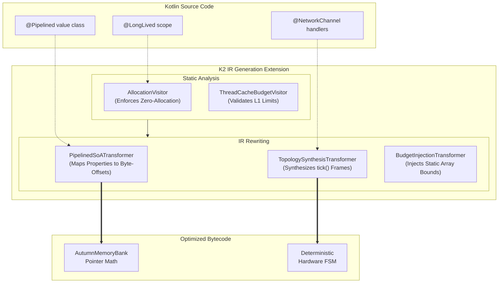

# autumn-compiler-plugin

The Kotlin K2 Compiler Plugin for Autumn. This is the cornerstone of the **Circuit-Based Programming** architecture, acting as the strict verifier and FSM hardware synthesizer that turns idiomatic Kotlin into DPDK-tier execution layers across JVM and Native targets.

## Why a Compiler Plugin?

Standard frameworks utilize reflection, lazy DI containers, and dynamic object allocation, discovering Out-Of-Memory (OOM) errors and layout bugs at runtime. The Autumn compilation philosophy is that if your software is going to exceed hardware limits (like an L1 Cache boundary), the build should mathematically fail on the developer's machine.

By integrating directly at the Intermediate Representation (IR) generation phase, Autumn bypasses standard object allocation semantics and statically unrolls execution topologies before the code even reaches the backend LLVM/JVM compilers.

## Core Transformers & Optimizations

### 1. Topology Synthesis (`TopologySynthesisTransformer.kt`)
This is the heart of Autumn's high-speed routing. The plugin sweeps the codebase for hardware-annotated boundaries (`@NetworkChannel`, `@ColdChannel`, etc.) and completely rewrites the developer's idiomatic function blocks:
- **Deterministic Frame Unrolling:** The compiler generates a single deterministic execution frame (a static sequence of `if(poll >= 0) { ... commit() }` evaluations) rather than monolithic `while(true)` spinloops. This allows the host platform (like `AutumnScheduler` or Android's `Choreographer`) to drive the pipeline cooperatively, eliminating thermal throttling and ANRs while preserving A Priori cycle costing.
- **Hardware-Sympathetic Queues:** It binds the unrolled frames directly to pre-allocated `Channel` multiplatform SPSC structures via the `poll()` function, natively injecting thread-aware cache yields when the circuit is dry.
- **Topological Thread Binding:** When it detects `@NetworkChannel(sharded = N)`, it injects `AutumnRuntime.spawn` calls, mapping FSM bounds lock-free across `N` physically padded threads.

### 2. Global Memory Struct Pooling (`@Pipelined` Interception)
Autumn overrides traditional object orientation. When the K2 compiler encounters a `value class` annotated with `@Pipelined`, it prevents standard JVM boxing/unboxing entirely.
- The K2 plugin mathematically calculates the byte boundaries of every getter property on that class to assign a statically computed global byte-offset memory map.
- Calling `event.price` on the struct is natively intercepted by the compiler during the `visitCall` AST phase. The `.price` invocation is deleted and rewritten to natively inject `AutumnMemoryBank.getInt(BASE_STATIC_ADDRESS + (index * 4))`. This establishes a complete Structure of Arrays (SoA) layout effortlessly, letting developers write beautiful OOP syntax while extracting pure primitive array physics at runtime.

### 3. Static Constraint Verification
- **Allocation Enforcement:** A custom K2 IR visitor scans all scopes marked mathematically as `@LongLived`. If it detects any heap-allocated objects being spawned or closures instantiated (instead of basic array mutations), it will abort the build.
- **Budget Injection (`BudgetInjectionTransformer`):** It sweeps the IR tree for configurations like `@NetworkConcurrencyBudget` or `@InjectBudget` and evaluates them into static `IrConst` integer literals. Dynamic concurrency layouts literally disappear from the final bytecode, replaced by statically sized `IntArray` initializations matching strict `ADR-0010` architectural capacities.
