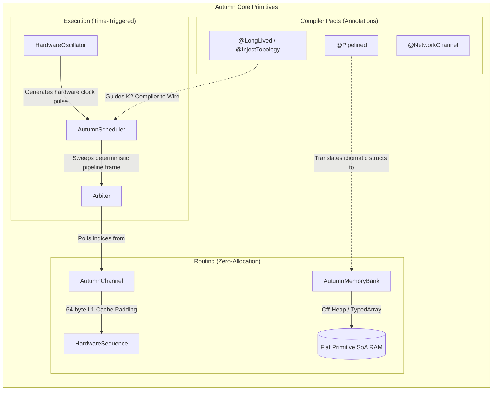

# autumn-core

Core interfaces, standard library primitives, and shared domain models for Autumn. This module defines the foundational hardware-sympathetic contracts used heavily by the compiler plugin to synthesize zero-allocation pipelines.

## Core Architecture Map

## The "Standard Library" of an HLS Framework

In standard Android/iOS development, core modules hold DTOs and interfaces (`User`, `Repository`). In Autumn, `autumn-core` acts as a High-Level Synthesis (HLS) standard library. It provides the low-level mechanical primitives and **Compiler Pacts** (Annotations) required to map high-level Kotlin directly onto CPU physical bounds.

### Hardware Engineering Techniques Built-In

1. **Zero-Config Cache-Line Padding (`Channel.kt`)**
   Standard JVM environments heavily restrict the `@Contended` annotation to prevent false sharing. Autumn bypasses this natively using a JVM implementation detail: the JVM does not interleave class fields across an inheritance boundary. By nesting `Producer` and `Consumer` L1-tracker indices down an abstract class hierarchy (`ChannelPad1` -> `ChannelProducer` -> `ChannelPad2`), Autumn enforces a strict, physically mandated 64-byte hardware gap. This prevents CPU cores from invalidating each other's cache lines during heavy concurrency, dropping cross-thread latencies to `~29ns`.

2. **Cooperative Deterministic Timers (`AutumnScheduler` & `HardwareOscillator`)**
   Relying on OS-level `wait/notify` locks or `while(true)` spinloops normally guarantees massive latency spikes via kernel context switching or devastating thermal throttling. Autumn introduces "Clock-Aware" execution via the `HardwareOscillator`. The K2 compiler generates an absolute, deterministic execution frame (a lock-free data sequence) which the oscillator pulses. When a queue is dry, it applies platform-specific power-saving (`Thread.onSpinWait()`, `yield()`, or Core Parking) to keep the core optimally cool but instantly reactive.

3. **Memory Barriers without Cache Flushing (`HardwareSequence.kt`)**
   Standard `@Volatile` fields trigger Sequentially Consistent (`StoreLoad`) hardware barriers, forcing the CPU to flush its entire write buffer. Autumn uses a custom `HardwareSequence` multiplatform primitive that leverages lock-free `Acquire/Release` semantics (e.g., `lazySet` on the JVM, matching `memory_order_release` in C++). This strictly limits execution reordering while allowing the CPU to aggressively pipeline instructions.

4. **Structure of Arrays (SoA) Off-Heap Routing (`AutumnMemoryBank.kt`)**
   Rather than instantiating object graphs on the heap, data lives in giant continuous flat primitive arrays (Integers / Longs). Pointers are passed around as raw primitive 32-bit indices.

## Compiler Pacts (Annotations)

Autumn developers don't write manual hardware math—they write idiomatic Kotlin constrained by these pacts. The K2 Compiler Plugin intercepts these markers:

- `@Pipelined`: Indicates a struct (typically a `@JvmInline value class`) that should never be instantiated. The compiler rewrites its property getters to perform pointer-math directly against the `AutumnMemoryBank`.
- `@NetworkChannel(sharded = N)`: Defines the entry-point ring buffer. Instructs the compiler to unroll a multi-core FSM FSM block that polls this channel natively.
- `@ColdChannel`: A zero-copy multicast channel endpoint. Consumers track their own index into the upstream ring buffer without locking the hot path or duplicating memory.
- `@RegisterChannel`: A deterministic endpoint for executing SoA mutations in-place (e.g. OrderBook matching arrays or UI registry arrays).
- `@LongLived`: Enforces strict compile-time checks that objects matching this annotation never allocate on the heap dynamically during the FSM loop execution.

## Platform Specificities

Because Autumn targets Kotlin Multiplatform, these core primitives seamlessly adapt to the strict hardware reality of the running host environment:

### JVM / Android (ART)
- **Execution:** Autumn executes via a dedicated daemon `Thread` governed by the `HardwareOscillator` and `AutumnScheduler`, applying optimal `PAUSE` or `yield` instructions depending on pipeline backpressure.
- **Memory:** `AutumnMemoryBank` utilizes `sun.misc.Unsafe` (or `MemorySegment`/`VarHandle` on modern JDKs) to allocate flat gigabyte-tier contiguous off-heap memory arrays, making them invisible to the JVM Garbage Collector.
- **Atomics:** `HardwareSequence` delegates to `AtomicLong` using `get()` and `lazySet()` to satisfy `Acquire/Release` hardware barriers.

### Kotlin/Native (Linux HFT / iOS / macOS)
- **Execution:** Autumn maps directly to raw POSIX pthreads. On Linux, this enables true bare-metal `isolcpus` and `taskset` binding, meaning the OS scheduler is literally evicted from the core, dedicating a 100% uninterrupted clock cycle to the Autumn FSM.
- **Networking:** The C-Interop layer allows `AutumnMemoryBank` to be mapped straight to Linux `AF_XDP` sockets. Network Interface Cards (NICs) DMA transfer packets straight into the bounded array bypassing the Linux Kernel completely.
- **Atomics:** Compiles to raw LLVM `atomic` instructions (`memory_order_release` / `memory_order_acquire`).

### Kotlin/JS & Wasm (Web)
- **Execution:** Since the web runs in a strict single-threaded Event Loop, the structural spinloop natively unwinds. The `HardwareOscillator` maps directly to `requestAnimationFrame` or Web Worker loops, executing the exact same FSM mathematical ticks cooperatively without blocking the browser UI thread.
- **Memory:** `AutumnMemoryBank` binds natively to contiguous Javascript `Int32Array` / `BigInt64Array` typed array buffers, allowing JavaScript engines (V8/JavaScriptCore) to JIT compile the struct routing directly to heavily optimized Vector (SIMD) Assembly instructions without JS object GC tracking.
