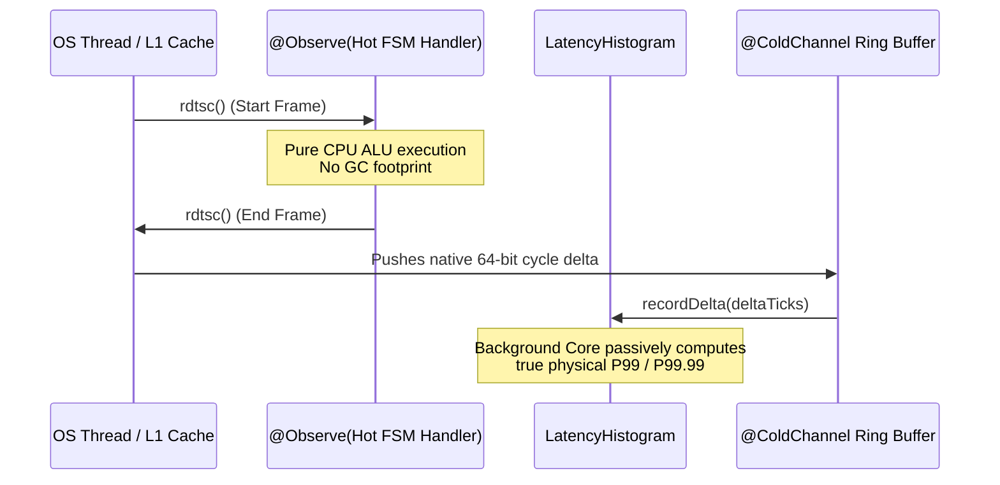

# Autumn Observatory (`autumn-observatory`)

Standard Application Performance Monitoring (APM) tools destroy ultra-low-latency applications by allocating metric-tracking objects, creating garbage collection bloat, and issuing expensive locking system calls just to track spans.

**Autumn Observatory** introduces the concept of **Zero-Allocation Hardware Telemetry**.

## How It Works

By simply annotating your pipeline components with `@Observe("MetricName")`, the Autumn K2 compiler statically parses your Kotlin Abstract Syntax Tree and physically weaves hardware clock queries (`NativeClock.rdtsc()`) around your execution graph natively. 

These instructions evaluate within nanoseconds and feed entirely flat `LatencyHistogram` matrices without allocating a single JVM object or triggering a kernel context switch.

Because the hardware clock telemetry is completely decoupled from the OS and pushed across a `@ColdChannel` to an isolated CPU core, the Hot Path execution engine (the trader, the game renderer, the packet parser) is fully monitored in production without encountering "Heisenbugs" caused by the telemetry overhead itself.
